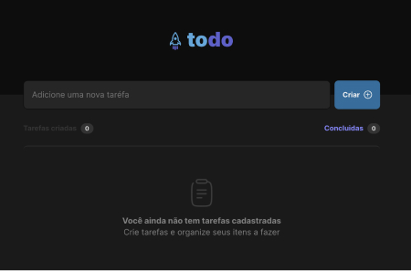

## TO DO - TAKE YOUR TASKS

   

A project exploring TypeScript and Vite to implement a feature that allow the user create, delete and check your tasks



### [Click to take a look](https://todo-rocketseat-challenge-tau.vercel.app/)

## Installation

requires [Node.js](https://nodejs.org/) v18+ to run.

Install the dependencies and devDependencies and start the server.

```sh
cd todo-rocketseat-challenge
npm i
npm run dev
```

## Dependencies

There is no dependencies.

| dependencies | version |
| ------ | ------ |
| none | -.-.- |

## Dev Dependencies

There is no dev dependencies.

| dependencies | version |
| ------ | ------ |
| none | -.-.- |


## License

MIT

**Free Software**
